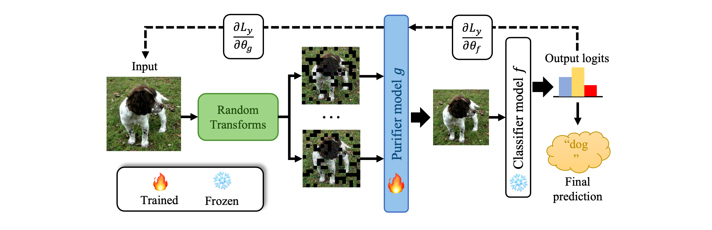

## Adversarial Training on Purification (AToP)
<p align="center">
  
</p>

The code of the ICLR 2024 paper:
[Adversarial Training on Purification (AToP): Advancing Both Robustness and Generalization](https://openreview.net/pdf?id=u7559ZMvwY)

Abstract: The deep neural networks are known to be vulnerable to well-designed adversarial attacks. The most successful defense technique based on adversarial training (AT) can achieve optimal robustness against particular attacks but cannot generalize well to unseen attacks. Another effective defense technique based on adversarial purification (AP) can enhance generalization but cannot achieve optimal robustness. Meanwhile, both methods share one common limitation on the degraded standard accuracy. To mitigate these issues, we propose a novel pipeline to acquire the robust purifier model, named Adversarial Training on Purification (AToP), which comprises two components: perturbation destruction by random transforms (RT) and purifier model fine-tuned (FT) by adversarial loss. RT is essential to avoid overlearning to known attacks, resulting in the robustness generalization to unseen attacks, and FT is essential for the improvement of robustness. To evaluate our method in an efficient and scalable way, we conduct extensive experiments on CIFAR-10, CIFAR-100, and ImageNette to demonstrate that our method achieves optimal robustness and exhibits generalization ability against unseen attacks.

For the pre-trained GAN-bsed model, we use the code from [deepfillv2-pytorch](https://github.com/nipponjo/deepfillv2-pytorch), a PyTorch reimplementation of DeepFillv2 based on the [original TensorFlow implementation](https://github.com/JiahuiYu/generative_inpainting).

### Citation
```
@article{lin2024adversarial,
  title={Adversarial Training on Purification (AToP): Advancing Both Robustness and Generalization},
  author={Lin, Guang and Li, Chao and Zhang, Jianhai and Tanaka, Toshihisa and Zhao, Qibin},
  journal={arXiv preprint arXiv:2401.16352},
  year={2024}
}
```
